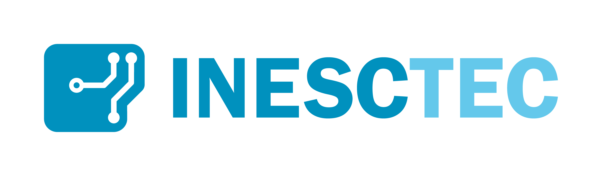
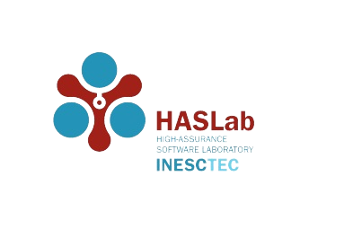

# QWAK
Quantum Walk Analysis Kit - Continuous-time quantum walk analysis framework.


## Table of Contents:

- [Installation](#installation)
- [Usage](#usage)
- [Documentation](#documentation)
- [Contributing](#contributing)

## Funding

This work is financed by National Funds through the Portuguese funding agency, FCT - Fundação para a Ciência e a Tecnologia, within project UIDB/50014/2020.

<p>
<center></center>
<center>  </center></p>

## Installation

Installing the package is very straightforward. Firstly, clone the project and then install the requirements via pip, followed by `pip install .` in the cloned folder. A virtual environment is highly recommended.

#### Dependencies
- Numpy
- Scipy
- Sympy
- matplotlib
- networkx
- QuTip
- eel

Step-by-step installation instructions can be found in the documentation [installation](https://jaimepsantos.github.io/QWAK/installation.html) page.


## Usage
A basic plot of the probability distribution for a CTQW with a walker starting in a superposition of central positions, in a cyclic graph, can be achieved via the following example:
```python
import networkx as nx
import matplotlib.pyplot as plt
from qwak.qwak import QWAK

n = 100
t = 12
initState = [n//2,n//2 + 1]
graph = nx.cycle_graph(n)

qwak = QWAK(graph)
qwak.runWalk(t,initState)

probVec = qwak.getProbVec()
plt.plot(probVec)
plt.show()
```
Further examples exploring all the different components will be available once the [usage](https://jaimepsantos.github.io/QWAK/usage.html) documentation is complete.

## Documentation
Documentation is a work in progress, and can be found in this [page](https://jaimepsantos.github.io/QWAK/).

## Contributing

#### Extra requirements
- autopep8
- pytest
- sphinx

Contributing to the package follows a relatively simple workflow. After performing the necessary setup procedures, 
you will update your fork with the latest version of the QWAK project. You can now perform your changes, format 
them and test them. If a new feature is added, you will need to add docstrings to the new methods and update the
existing documentation accordingly. If your contribution is directly to the documentation, you will follow a similar procedure.

Step-by-step instructions on how to setup all the required components for organized contribution can be found
on the [contributing](https://jaimepsantos.github.io/QWAK/contributing.html) documentation page.
