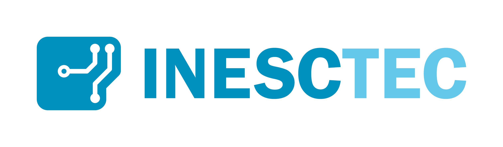
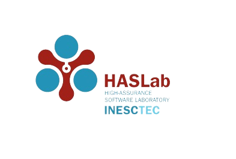

QWAK - Quantum Walk Analysis Kit
=================================

:py:class:`.QWAK` is an object-oriented Python package for the realization of
continuous-time quantum walks. With this package you have the ability to perform both
unitary pure quantum walks, as well as introduce classical effects with the :py:class:`.StochasticQWAK`
quantum walk.

Additionally, a graphical user interface is provided as a user
friendly alternative, where it is possible to study several different aspects of the quantum
walk without having prior coding knowledge. See the :doc:`installation <installation>` page for more information.

Alternatively, a fullstack web app is available on `Heroku <https://qwak-sim.herokuapp.com/>`_. This app is
built using Flask and PyMongo. The Flask server generates a session for each user, and a database collection is created
for each session. The collection will be made of static and dynamic QWAK JSON objects, which will be converted to
a Python class instance in Flask.

Gallery
-------

|staticMultipleTime| |dynamicSingleWalk|

Funding
-------

This work is financed by National Funds through the Portuguese funding agency, FCT - Fundação para a Ciência e a Tecnologia, within project UIDB/50014/2020.

|inescLogo| |haslabLogo|

Contents
--------
.. toctree::
   :maxdepth: 2
   :caption: Contents:

   installation
   dependencies
   conda_setup
   venv_setup
   usage
   contributing
   modules