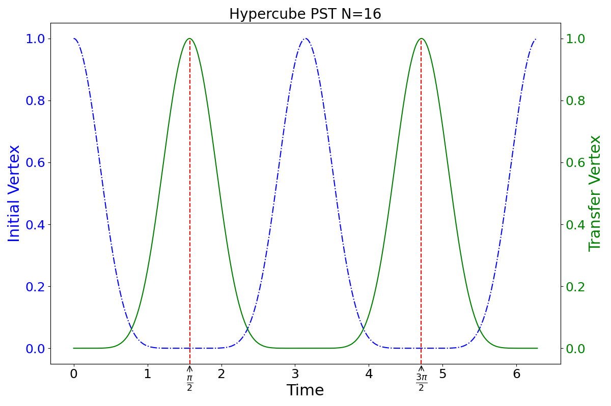

Perfect State Transfer
=======================

.. WARNING:: This page is under construction.

To showcase the capabilities of the perfect state transfer (PST) functionality
within QWAK, we present a hands-on example featuring a quantum walk on a
4-dimensional hypercube graph. This choice of graph is particularly instructive
because hypercube graphs are a well-studied class of graphs with interesting
topological properties. For this demonstration, we initialize the quantum walk
at vertex 0. This choice of initial vertex serves as the starting point for
the state transfer process.

.. code-block:: python
   :linenos:

   n = 4
   graph = nx.hypercube_graph(n)
   initcond = [0]

   qw = QWAK(graph=graph)
   t = eval(str(qw.checkPST(0,15)))
   qw.runWalk(time=t, initStateList=initcond)
   plt.plot(qw.getProbVec())

In the above code, a 4-dimensional hypercube with 16 nodes is created using
``NetworkX``. The walker starts at vertex 0, and the ``checkPST``
function returns the time value for which PST occurs between the antipodal
vertices, or `-1` if it does not. For this hypercube, PST happens at :math:`t =
\frac{\pi}{2}`, consistent with all `N`-dimensional hypercubes. This can be confirmed by iteratively
running the ``checkPST`` function for all antipodal vertex pairs contained
in the structure. The quantum walk is then executed for this time duration via
``runWalk``, and ``Matplotlib`` is used to plot the resulting
probability vector, showing complete transfer from vertex 0 to 15.

|hypercubePST|

The previous figure was plotted using an utility function present in
the notebook, illustrating the evolution of the probability of finding a walker
between the vertices we expect PST to occur. PST is a cyclic phenomenon that
occurs every :math:`2\tau`, being :math:`\tau` the initial PST time (in this case :math:`\pi/2`).
This is a direct consequence of the fact that there is PST from vertex :math:`a` to
:math:`b`, then there is also from :math:`b` to :math:`a`. This can all be observed in the figure
with the blue lines indicating the evolution for the initial vertex and the
green line for the final vertex. Notice that PST return to the original vertex
every :math:`t=\pi`, since PST occurred at time :math:`\pi/2` from vertex 0 to vertex 15,
then at time :math:`\pi/2 + \pi` the walker returns to vertex 15. PST is successfully
achieved, confirming the efficacy of the algorithm.
