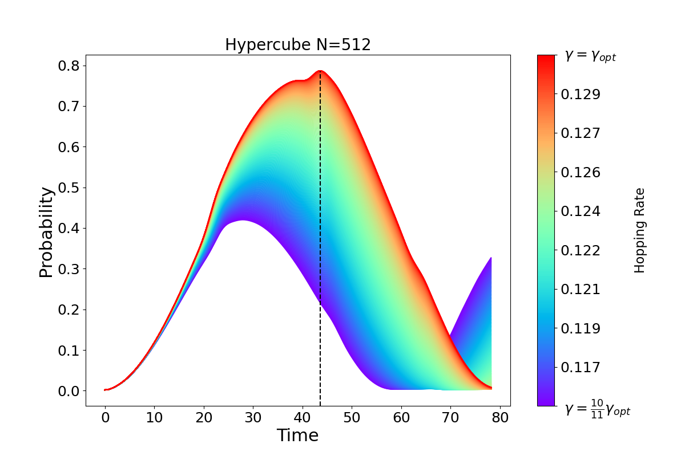

Searching With QWAK
===================

.. WARNING:: This page is under construction.

Here, we will go over the searching algorithm using QWAK for several different structures.

Complete Graph
--------------

Single Element
^^^^^^^^^^^^^^
To use QWAK for searching, we need to define a graph for the search space, and
the targets are marked elements, specified as a list of weighted node indices.
For a complete graph, the optimal transition rate is :math:`\gamma = \frac{1}{n}`,
resulting in a search time of :math:`\mathcal{O}(\sqrt{N})`, comparable to Grover's
algorithm.

.. code-block:: python
   :linenos:

   n = 200
   t = (np.pi/2) * np.sqrt(n)
   gamma = 1/n
   init = list(range(0,n))
   graph = nx.complete_graph(n)
   qw = QWAK(graph, gamma=gamma, markedElements=[(n//2, -1)],
             laplacian=False)
   qw.runWalk(t, initStateList=init)

Firstly, we initialize ``QWAK`` with the desired simulation parameters,
so that we can calculate the search problem via the ``runWalk`` method.
Because we created the object with a list of marked elements, the Hamiltonian
of the method will be described as:

.. math::
   H^\prime = -\gamma A - \sum_{x \in M} \ket{x}\bra{x}

.. |completeGraphSearching| image:: ../../Images/SoftwareUsage/Searching/completePlot_N512_NWALKS3_S200.png
   :width: 50 %
   :align: middle

|completeGraphSearching|

The optimal time for the search problem also depends on the number of solutions,
and the previous figure presents the evolution of the sum probability of all the
marked elements. The utility functions needed to plot this figure are available
in the package.

Multiple Elements
^^^^^^^^^^^^^^^^^

.. code-block:: python
   :linenos:

   markedElements = [(n//2,-1),(n//2+1,-1)]
   t = (np.pi/2) * np.sqrt(n/len(markedElements))

To search for multiple elements, we simply extend the ``markedElements``
list and fine-tune the optimal evolution time. The aforementioned figure
demonstrates that as the number of marked elements increases, the time required
to reach maximum probability decreases. Specifically, when we mark
:math:`\frac{1}{4}` of the total elements, the walk evolves optimally in time :math:`\pi`.
This scenario is analogous to the *single-shot Grover algorithm*, where
the highest probability for finding the solution is achieved in just one step.

Hypercube
---------

The :math:`n`-dimensional hypercube is a graph of :math:`N=2^n` vertices, where two vertices
will be connected if one differs only in a single bit from the other.

The evolution of the search problem over this structure presents a sharp
transition at a critical value of :math:`\gamma`, given by

.. math::
   :label: gamma_opt

   \gamma_{\text{opt}} = \frac{1}{2^n} \sum_{r=1}^n \binom{n}{r} \frac{1}{r} = \frac{2}{n} + O\left(n^{-2}\right)

Here, we attempt to showcase that the maximum probability of the solution is
indeed sensitive to the transition rate. For this purpose, we create a
``QWAK`` object for each value of :math:`\gamma`, and then we evolve the walk in
a time interval with the ``runMultipleWalks`` function.

.. code-block:: python
   :linenos:

   n = 9
   gamma = gamma_hypercube(n)
   graph = nx.hypercube_graph(n)

   N = 2**n
   t = (np.pi/2) * np.sqrt(N)
   mElem = [(N//2, -1)]
   initSL = list(range(0,N))
   probDistMat = []

   for gamma in gammaList:
       qw = QWAK(graph=graph, gamma=gamma,
                 initStateList=initSL, markedElements=mElem)
       qw.runMultipleWalks(timeList=tList)
       probDistMat.append(qw.getProbDistList())

The probability distribution matrix is composed of lists of
``ProbabilityDistribution`` objects, for each value of :math:`\gamma`. We now
generate a plot to visualize the search process and the effect of different
values of :math:`\gamma` on the probability of finding the marked element. The plot
is shown in the following figure, obtained with auxiliary functions
available in the notebook.

|hypercubeGraphSearching|

We can see from the plot that despite having a very narrow range of transition
rate values, :math:`\gamma_{\text{opt}}` does indeed reach maximum probability within time
that scales with :math:`\mathcal{O}\sqrt{N}`.
